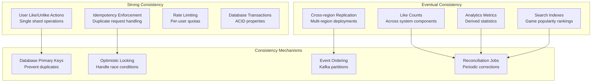

# Like/Unlike System Design - High Scale Architecture

## 1. Requirements Analysis

### Functional Requirements
- Users can like/unlike games on Roblox platform
- Display accurate like counts for each game
- Support user's like history/status
- Handle duplicate like/unlike requests idempotently
- Real-time updates to like counts
- Support bulk operations (get likes for multiple games)

### Non-Functional Requirements
- **Scale**: 10K → 100K → 1M QPS writes, 5M QPS reads
- **Latency**: < 100ms for like/unlike operations, < 50ms for reads
- **Availability**: 99.9% uptime
- **Consistency**: Eventually consistent for counts, strong consistency for user actions
- **Data Retention**: Store all like events for analytics
- **Global Distribution**: Support worldwide users

## 2. API Design

### Core APIs
```
POST /v1/likes
{
  "user_id": "123456",
  "game_id": "game_789",
  "action": "like"  // or "unlike"
}

GET /v1/likes/game/{game_id}/count
Response: { "count": 15420, "timestamp": "2025-09-08T10:30:00Z" }

GET /v1/likes/user/{user_id}/status/{game_id}
Response: { "liked": true, "timestamp": "2025-09-08T09:15:00Z" }

GET /v1/likes/user/{user_id}/games?limit=50&offset=0
Response: { "liked_games": [...], "total": 142 }

POST /v1/likes/batch/count
{
  "game_ids": ["game_1", "game_2", "game_3"]
}
Response: { "counts": { "game_1": 1500, "game_2": 2300 } }
```

## 3. System Architecture

### High-Level Components

```
[Load Balancer] → [API Gateway] → [Like Service] → [Databases]
                                      ↓
                              [Event Streaming] → [Analytics & ML]
                                      ↓
                              [Count Aggregator] → [Cache Layer]
```

### Microservices Architecture

#### 3.1 Like Service (Core)
- **Responsibility**: Handle like/unlike operations, maintain user-game relationships
- **Technology**: Go/Java with Redis for session management
- **Scaling**: Stateless, horizontally scalable
- **Database**: PostgreSQL (partitioned by user_id)

#### 3.2 Count Aggregation Service
- **Responsibility**: Maintain accurate like counts per game
- **Technology**: Kafka Streams / Apache Flink for stream processing
- **Database**: Redis for real-time counts, ClickHouse for historical data
- **Pattern**: CQRS (Command Query Responsibility Segregation)

#### 3.3 Real-time Notification Service
- **Responsibility**: Push live count updates to clients
- **Technology**: WebSocket servers, Redis Pub/Sub
- **Scaling**: Connection pooling, geographic distribution

#### 3.4 Analytics Service
- **Responsibility**: Process like events for insights, recommendations
- **Technology**: Apache Spark, Kafka Connect
- **Database**: Data Lake (S3) + Apache Druid for fast analytics

## 4. Database Design

### 4.1 Transactional Database (PostgreSQL)

#### User Likes Table (Partitioned by user_id)
```sql
CREATE TABLE user_likes (
    id BIGSERIAL,
    user_id BIGINT NOT NULL,
    game_id BIGINT NOT NULL,
    liked BOOLEAN NOT NULL,
    created_at TIMESTAMP DEFAULT NOW(),
    updated_at TIMESTAMP DEFAULT NOW(),
    PRIMARY KEY (user_id, game_id),
    INDEX idx_user_likes_created (user_id, created_at),
    INDEX idx_game_likes (game_id, liked, created_at)
) PARTITION BY HASH(user_id);
```

#### Game Metadata Table
```sql
CREATE TABLE games (
    id BIGINT PRIMARY KEY,
    name VARCHAR(255) NOT NULL,
    creator_id BIGINT NOT NULL,
    created_at TIMESTAMP DEFAULT NOW(),
    INDEX idx_creator (creator_id)
);
```

### 4.2 Cache Layer (Redis Cluster)

#### Like Counts Cache
```
Key: "game:count:{game_id}"
Value: JSON { "count": 15420, "last_updated": 1694167800 }
TTL: 300 seconds (5 minutes)
```

#### User Like Status Cache
```
Key: "user:likes:{user_id}"
Value: SET of game_ids
TTL: 3600 seconds (1 hour)
```

#### Rate Limiting Cache
```
Key: "rate_limit:{user_id}:{window}"
Value: Counter
TTL: Based on window size
```

### 4.3 Analytics Database (ClickHouse)

#### Like Events Table
```sql
CREATE TABLE like_events (
    event_id String,
    user_id UInt64,
    game_id UInt64,
    action Enum8('like' = 1, 'unlike' = 2),
    timestamp DateTime,
    ip_address String,
    user_agent String,
    session_id String
) ENGINE = MergeTree()
PARTITION BY toYYYYMM(timestamp)
ORDER BY (game_id, timestamp, user_id);
```

## 5. Streaming and Real-time Processing

### 5.1 Event Streaming Architecture (Apache Kafka)

#### Topic Design
```
like-events: Partitioned by game_id (for ordered processing per game)
├── Partition 0: game_ids ending 0,5
├── Partition 1: game_ids ending 1,6
└── ...

count-updates: Partitioned by game_id
user-notifications: Partitioned by user_id
```

#### Why Kafka over Message Queues?
- **Ordered Processing**: Ensures like events for same game processed in order
- **Replay Capability**: Can reprocess events for count corrections
- **Multiple Consumers**: Analytics, notifications, and aggregation can consume same stream
- **Durability**: Persistent storage of all events for audit trail
- **Throughput**: Can handle 1M+ messages/second per broker

### 5.2 Stream Processing Pipeline

#### Count Aggregation (Kafka Streams)
```java
KStream<String, LikeEvent> likeEvents = builder.stream("like-events");

KTable<String, Long> likeCounts = likeEvents
    .filter((key, event) -> event.getAction().equals("like"))
    .groupBy((key, event) -> event.getGameId())
    .aggregate(
        () -> 0L,
        (gameId, event, count) -> count + 1,
        Materialized.as("like-counts-store")
    );

// Output to count-updates topic and Redis
likeCounts.toStream().to("count-updates");
```

## 6. Scaling Strategy

### 6.1 10K QPS (50K Reads)
- **Infrastructure**: 3 API servers, 1 PostgreSQL primary + 2 read replicas
- **Cache**: Single Redis instance with replication
- **Message**: Single Kafka broker
- **Cost**: ~$500/month

### 6.2 100K QPS (500K Reads)
- **Infrastructure**: 10 API servers across 2 AZs, PostgreSQL cluster (3 primary shards)
- **Cache**: Redis Cluster (6 nodes), read replicas in each AZ
- **Message**: Kafka cluster (3 brokers), consumer groups for parallel processing
- **CDN**: CloudFlare for static content and API caching
- **Cost**: ~$5,000/month

### 6.3 1M QPS (5M Reads)
- **Infrastructure**: Auto-scaling groups (50-100 API servers), multi-region deployment
- **Cache**: Redis Cluster per region (20+ nodes), L1 cache in API servers
- **Database**: Sharded PostgreSQL across 10+ databases, read replicas in each region
- **Message**: Multi-region Kafka clusters, cross-region replication
- **CDN**: Multi-tier caching, edge computing for count aggregation
- **Cost**: ~$50,000/month

## 7. Key Design Decisions & Tradeoffs

### 7.1 Eventual Consistency for Counts
**Choice**: Use eventually consistent counts with periodic reconciliation
**Rationale**: 
- Immediate consistency would require distributed locks (performance killer)
- Users tolerate slight delays in count updates
- Reconciliation jobs correct any drift

**Tradeoff**: Temporary count inaccuracies vs. system performance

### 7.2 CQRS Pattern
**Choice**: Separate write and read paths for likes
**Rationale**:
- Write operations focus on data integrity
- Read operations optimized for performance with denormalized views
- Independent scaling of read vs write workloads

**Tradeoff**: System complexity vs. performance and scalability

### 7.3 Event Sourcing for Audit Trail
**Choice**: Store all like/unlike events permanently
**Rationale**:
- Complete audit trail for debugging and analytics
- Ability to reconstruct state at any point in time
- Supports complex analytics and ML features

**Tradeoff**: Storage costs vs. debugging capability and analytics value

### 7.4 Kafka vs SQS/RabbitMQ
**Choice**: Apache Kafka for event streaming
**Rationale**:
- **Ordering**: Partition-level ordering ensures consistent processing
- **Durability**: Built-in replication and persistent storage
- **Throughput**: Can handle millions of messages per second
- **Multiple Consumers**: Same event stream serves multiple use cases
- **Ops Maturity**: Well-established operational patterns

**Alternative Considered**: Amazon SQS
- Pros: Fully managed, auto-scaling, simpler ops
- Cons: No ordering guarantees, higher latency, limited throughput per queue

### 7.5 Database Sharding Strategy
**Choice**: Shard user_likes by user_id, games table remains unsharded
**Rationale**:
- User queries (my likes) are efficiently served from single shard
- Game count queries aggregate across shards (acceptable for read path)
- Avoids complex cross-shard transactions

**Tradeoff**: Cross-shard queries for game stats vs. simple user operations

## 8. Monitoring and Observability

### Key Metrics
- **Latency**: P50/P95/P99 for API endpoints
- **Throughput**: QPS per endpoint, Kafka message rates
- **Error Rates**: 4xx/5xx error percentages
- **Business Metrics**: Unique likes per day, like rate per game
- **Infrastructure**: Database connection pool usage, cache hit rates

### Alerting Strategy
- **Critical**: API error rate > 1%, Database connections > 80%
- **Warning**: Cache hit rate < 95%, Kafka consumer lag > 1000 messages
- **Business**: Daily active likes drop > 20% day-over-day

## 9. Data Consistency Guarantees

## 11. Data Consistency Guarantees

### Consistency Model Overview



### Consistency Guarantees by Component

```mermaid
graph LR
    subgraph "Write Path - Strong Consistency"
        API[API Request]
        DB[(PostgreSQL<br/>ACID Transactions)]
        Event[Kafka Event<br/>Ordered per game)]
    end
    
    subgraph "Read Path - Eventual Consistency"
        Cache[(Redis Cache<br/>May lag behind)]
        Analytics[(ClickHouse<br/>Eventually consistent)]
        Rankings[Top Games<br/>Updated periodically]
    end
    
    subgraph "Reconciliation"
        Batch[Batch Jobs<br/>Correct drift]
        Monitor[Monitoring<br/>Detect issues]
    end
    
    API --> DB
    DB --> Event
    Event --> Cache
    Event --> Analytics
    Cache --> Rankings
    
    DB --> Batch
    Cache --> Batch
    Batch --> Cache
    Batch --> Monitor
```

This architecture provides a comprehensive solution that can scale from 10K to 1M QPS while maintaining data integrity and providing excellent user experience. The diagrams show how each component interacts and where critical business logic is placed for optimal performance and consistency.
